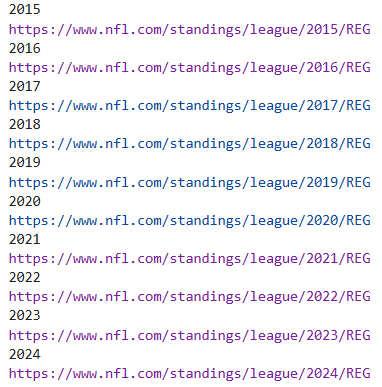
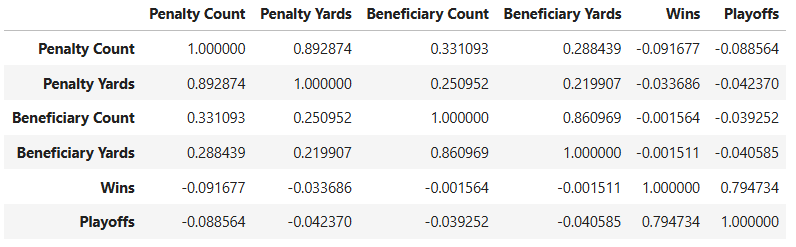
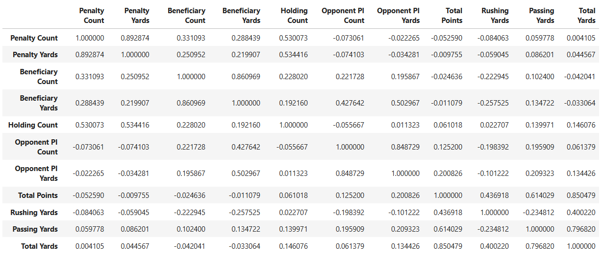
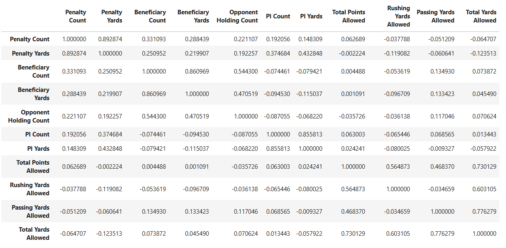
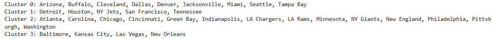
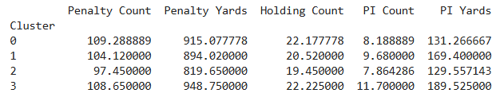
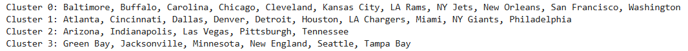
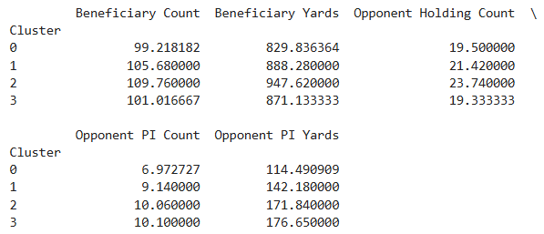

# BAIS:3250 Final Project
## _NFL Penalties and Performance_

### Table of Contents
1. Project Overview
2. Data Sources
3. Data Collection and Cleaning
4. Analysis Questions
5. Key Findings
6. Future Work

### Project Overview
This project analyzes NFL penalty data to explore whether penalties influence team performance, vary across seasons, or disproportionately affect certain teams. Prompted by growing public concerns over fairness and the perception that the NFL may be "rigged" in favor of specific teams, this analysis uses data from the 2015–2024 seasons to examine patterns in how penalties are called and who benefits from them.

The three main questions addressed in this project are:
1. How do penalties affect team performance?
2. Are there seasonal trends in penalty data?
3. Are certain teams more or less likely to receive penalties?

By combining penalty data with team statistics and outcomes, the project aims to identify whether there is statistical evidence to support or challenge the idea of bias or inconsistency in NFL officiating.


### Data Sources
| Source Name          | Website Link |
|----------------------|--------------|
| NFL Penalty Data     | [NFLPenalties.com](https://www.nflpenalties.com/) |
| Team Statistics      | [FootballDB.com](https://www.footballdb.com/) |
| Standings and Outcomes | [NFL.com Standings](https://www.nfl.com/standings/) |


### Data Collection and Cleaning
Data for this project was collected using Python and Selenium to automate the scraping of multiple websites. I gathered information from the 2015 to 2024 NFL seasons across the following areas:

- **Penalty data** (penalty counts, yards, offensive holding, and pass interference)
- **Offensive and defensive team statistics** (points scored, yards allowed)
- **Season outcomes** (wins, losses, playoff appearances)

Each dataset was scraped season-by-season using a `while` loop that dynamically generated URLs and verified the success of each request.

Here is an example of the scraping script used for NFL.com:
Each dataset was scraped season-by-season using a `while` loop that dynamically generated URLs and verified the success of each request.

Here is an example of the scraping script used for NFL.com:
```python
def scrape_record(browser, teams, win, loss, playoffs, season, current_year):
    
    table = browser.find_element(By.TAG_NAME, 'tbody')

    rows = table.find_elements(By.XPATH, './/tr')
    
    for row in rows:
        data = row.find_elements(By.XPATH, './/td')
        team = data[0]
        team_name = team.text.split()[0]
        teams.append(team_name)
        win.append(data[1].text)
        loss.append(data[2].text)
        season.append(current_year)
        if team.find_elements(By.XPATH, './/sup[text()="x"]'):
            playoff = 1
        else:
            playoff = 0
        playoffs.append(playoff)
    
    return teams, win, loss, playoffs, season`
```
```python
browser = webdriver.Chrome()

teams = []
win = []
loss = []
playoffs = []
season = []

year = 2015
page_counter = 1

while year <= 2024:
    print(year)
    url = "https://www.nfl.com/standings/league/" + str(year) + "/REG"
    print(url)
    browser.get(url)
    scrape_record(browser, teams, win, loss, playoffs, season, year)
    time.sleep(random.uniform(2, 8))
    
    page_counter += 1
    year += 1
```
    


Minimal cleaning was required. The main cleaning steps included:
- Using mapping dictionaries to standardize team names (resolving relocations and punctuation).
- Converting mascot names (e.g., "Chiefs") into full team names to allow merging across sources.
- Merging six datasets using `Season` and `Team` columns into one master DataFrame used for analysis.

The cleaned dataset was exported as a CSV file (`nfl_penalties.csv`) for use throughout the analysis.

**Data Dictionary:**
| Field                     | Type     | Source         | Description                                          |
|---------------------------|----------|----------------|------------------------------------------------------|
| Season                   | Numeric  | NFLPenalties   | Year of the season                                  |
| Team                     | Text     | NFLPenalties   | Location of the team                                |
| Wins                     | Numeric  | NFL.com        | Number of regular season wins                       |
| Losses                   | Numeric  | NFL.com        | Number of regular season losses                     |
| Playoffs                 | Binary   | NFL.com        | 1 if the team made the playoffs, 0 if not           |
| Penalty Count            | Numeric  | NFLPenalties   | Number of penalties                                 |
| Penalty Yards            | Numeric  | NFLPenalties   | Number of penalty yards                             |
| Beneficiary Count        | Numeric  | NFLPenalties   | Number of opponent penalties                        |
| Beneficiary Yards        | Numeric  | NFLPenalties   | Number of opponent penalty yards                    |
| Net Count                | Numeric  | NFLPenalties   | Difference between beneficiary and penalty count    |
| Net Yards                | Numeric  | NFLPenalties   | Difference between beneficiary and penalty yards    |
| Holding Count            | Numeric  | NFLPenalties   | Number of offensive holding penalties               |
| Opponent Holding Count   | Numeric  | NFLPenalties   | Number of opponent offensive holding penalties      |
| PI Count                 | Numeric  | NFLPenalties   | Number of pass interference penalties               |
| PI Yards                 | Numeric  | NFLPenalties   | Number of pass interference yards                   |
| Opponent PI Count        | Numeric  | NFLPenalties   | Number of opponent pass interference penalties      |
| Opponent PI Yards        | Numeric  | NFLPenalties   | Number of opponent pass interference yards          |
| Total Points             | Numeric  | Football DB    | Total points scored in the season                   |
| Rushing Yards            | Numeric  | Football DB    | Total rushing yards in the season                   |
| Passing Yards            | Numeric  | Football DB    | Total passing yards in the season                   |
| Total Yards              | Numeric  | Football DB    | Total yards in the season                           |
| Total Points Allowed     | Numeric  | Football DB    | Total opponent points scored in the season          |
| Rushing Yards Allowed    | Numeric  | Football DB    | Total opponent rushing yards in the season          |
| Passing Yards Allowed    | Numeric  | Football DB    | Total opponent passing yards in the season          |
| Total Yards Allowed      | Numeric  | Football DB    | Total opponent yards in the season                  |

### Analysis Questions
##### How do penalties affect team performance?
I explored whether penalty totals or yards were associated with worse team outcomes such as fewer wins or missing the playoffs. Correlation analysis and a logistic regression model showed that while penalties have a small negative impact on performance, they are **not strong predictors** of team success.
The following are the correlation coefficients:





##### Are there seasonal trends in penalties?
Using exponential smoothing and line graphs, I analyzed changes in penalty totals and subjective calls over time. No strong seasonal trends were found, but the **2020 season stood out** with unusually low holding calls and a spike in pass interference penalties, likely due to COVID-related officiating adjustments.

##### Are certain teams more or less likely to receive penalties?
I used bar charts and K-Means clustering to compare penalty patterns across teams. Some teams, like the Chiefs, received a surprisingly high number of subjective penalties, **contradicting public perceptions** of bias in their favor. Clustering also revealed that penalty behavior and beneficiary trends differ widely across franchises.
The following clusters are the results of similar penalty and beneficiary characteristics:






> Detailed analysis in [madymckee_analysis.ipynb](project_files/madymckee_analysis.ipynb) and [Final Project Report Sections 3.1-3.3](madymckee_finalprojectreport.pdf)

### Key Findings
- Penalties have **a weak but slightly negative correlation** with team performance metrics like wins and playoff appearances.
- **Subjective penalties** (e.g., holding and pass interference) do not appear to be consistently trending up or down over time, but 2020 showed significant anomalies due to COVID-era officiating changes.
- Some teams are **penalized or benefit significantly more than others**, and clustering revealed distinct groupings based on penalty behavior.
- Despite frequent claims of favoritism, the **Kansas City Chiefs received the most subjective penalties** over the past 10 seasons—challenging the public narrative of officiating bias in their favor.

### Future Work
- Incorporate **play-by-play data** to examine the timing and impact of penalties on drives and scoring.
- Analyze **referee-specific trends** to see if certain crews are more prone to calling specific penalties.
- Explore **sentiment analysis** or public reaction data to compare perceptions of bias to the actual data.
- Integrate **sports betting outcomes or line movements** to study the financial implications of penalty patterns.
